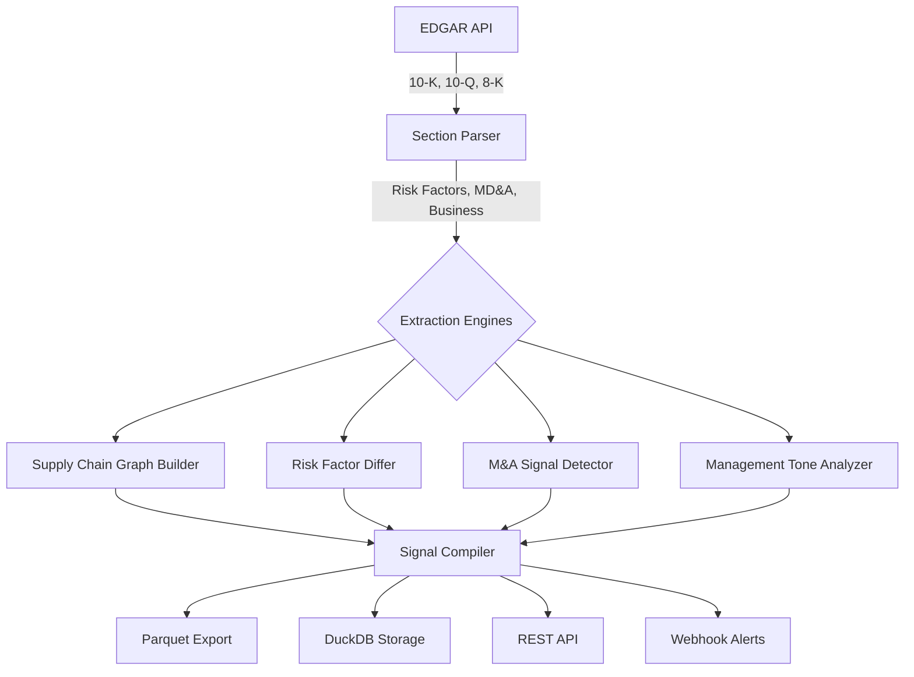

# alphasig

[](https://github.com/sushaan-k/alphasig/actions)
[](https://pypi.org/project/alphasig/)
[](https://pypi.org/project/alphasig/)
[](https://www.python.org/downloads/)
[](LICENSE)
[](https://github.com/astral-sh/ruff)

**Causal signal extraction from SEC filings using LLMs.**

`alphasig` turns filing text into structured, timestamped trading and monitoring signals. The focus is not generic sentiment, but directional changes in risk language, supplier exposure, M&A patterns, and topic-specific management tone.

---

## At a Glance

- Async EDGAR ingestion with filing parsing and section extraction
- LLM-assisted extraction engines for risk, supply chain, M&A, and tone
- Timestamped signal schema designed for storage and backtesting
- Supply-chain graph construction for second-order exposure analysis
- Parquet, DuckDB, API, and webhook outputs for downstream workflows

Every quant fund scrapes SEC filings. Sentiment analysis on 10-K/10-Q text is a solved, commoditized problem with zero alpha left. **alphasig** does something different: it extracts *causal, structural relationships* buried in filings -- supply chain dependencies, risk factor escalations, M&A language patterns, and topic-level management tone shifts -- and compiles them into timestamped, backtestable signals.

## Why This Exists

The difference between "sentiment is positive" (useless) and "Company X just added 'supply chain concentration risk' to their 10-K for the first time, and their top supplier is Company Y which reports next week" (actionable).

Research shows ([Lazy Prices, Cohen et al. 2020](https://papers.ssrn.com/sol3/papers.cfm?abstract_id=1658471)) that changes in 10-K language are among the strongest predictors of future returns. alphasig operationalizes this insight.

## Showcase

The built-in supply-chain graph utilities render dependencies as a directed network where **nodes represent companies** and **edges represent disclosed supplier/customer relationships**. Edge weights encode exposure magnitude extracted from filings (e.g., "40% of revenue from top supplier"). This enables second-order risk propagation: when TSMC faces a disruption, immediately identify all downstream companies with concentrated exposure.

## Architecture



## Extraction Engines

| Engine | What It Does | Key Insight |
|---|---|---|
| **Supply Chain** | Extracts supplier/customer/partner relationships into a knowledge graph | When TSMC has a disruption, know exactly which companies are exposed |
| **Risk Differ** | Diffs Item 1A between consecutive filings; classifies NEW, REMOVED, ESCALATED, DE_ESCALATED | Legal language changes are the strongest predictive signals (Lazy Prices) |
| **M&A Detector** | Identifies strategic-alternatives language, advisor engagements, cash positioning shifts | Certain filing patterns strongly precede M&A announcements |
| **Tone Analyzer** | Tracks topic-specific management tone across filings on a 6-point scale | Not "positive/negative" but "confident → hedging" on specific topics |

## Signal Types

| Type | Example | Typical Lead Time |
|---|---|---|
| `supply_chain` | "Apple adds TSMC concentration risk" | 5–10 trading days |
| `risk_change` | "ESCALATED: Regulatory scrutiny in Item 1A" | 1–3 trading days |
| `m_and_a` | "Strategic alternatives language in MD&A" | 10–30 trading days |
| `tone_shift` | "Management tone on margins shifted hedging → confident" | Next earnings |

## Quick Start

### Installation

```bash
pip install alphasig
```

### Basic Usage

```python
import asyncio
from sigint import Pipeline

async def main():
    pipeline = Pipeline(
        model="claude-sonnet-4-6",
        user_agent="Your Name your@email.com",
    )

    signals = await pipeline.extract(
        tickers=["AAPL", "MSFT", "GOOGL"],
        filing_types=["10-K", "10-Q"],
        lookback_years=3,
        engines=["supply_chain", "risk_differ", "m_and_a", "tone"],
    )

    # Filter high-conviction bearish signals
    bearish = signals.by_direction("bearish").above_strength(0.7)
    for sig in bearish:
        print(f"[{sig.ticker}] {sig.context}")

    # Build supply chain graph
    graph = signals.supply_chain_graph()
    exposure = graph.exposure("TSMC")
    print(f"Companies exposed to TSMC: {exposure['direct_dependents']}")

    # Export for backtesting
    signals.to_parquet("signals.parquet")

asyncio.run(main())
```

The public API is designed around `Pipeline` and `SignalCollection`, so the same extraction run can feed notebooks, alerting, or backtests without an adapter layer.

### CLI

```bash
# Extract signals
alphasig extract --tickers AAPL MSFT --lookback 3 --output signals.parquet

# Query stored signals
alphasig query --ticker AAPL --type risk_change --min-strength 0.7

# Launch REST API
alphasig serve --port 8080
```

### REST API

```bash
curl http://localhost:8080/signals?ticker=AAPL&min_strength=0.7
curl http://localhost:8080/signals/summary
```

## Configuration

alphasig reads the Anthropic API key from the `ANTHROPIC_API_KEY` environment variable. EDGAR requires a User-Agent with a contact email (SEC policy).

```bash
export ANTHROPIC_API_KEY="sk-ant-..."
```

## Signal Schema

Every signal follows a universal schema for backtesting compatibility:

```python
Signal(
    timestamp=datetime,          # Filing date (UTC)
    ticker="AAPL",               # Company ticker
    signal_type="risk_change",   # supply_chain | risk_change | m_and_a | tone_shift
    direction="bearish",         # bullish | bearish | neutral
    strength=0.85,               # 0.0 - 1.0
    confidence=0.92,             # 0.0 - 1.0
    context="ESCALATED: Supply chain concentration risk",
    source_filing="https://sec.gov/...",
    related_tickers=["TSMC"],
    metadata={...},              # Engine-specific details
)
```

## Project Structure

```
alphasig/
├── src/sigint/
│   ├── __init__.py          # Public API
│   ├── edgar.py             # Async EDGAR client with rate limiting
│   ├── parser.py            # HTML filing section parser
│   ├── llm.py               # Anthropic LLM client wrapper
│   ├── pipeline.py          # Main orchestration
│   ├── signals.py           # SignalCollection with filtering/export
│   ├── graph.py             # Supply chain NetworkX graph
│   ├── storage.py           # DuckDB signal store
│   ├── engines/
│   │   ├── supply_chain.py  # Supply chain extraction
│   │   ├── risk_differ.py   # Risk factor diffing
│   │   ├── m_and_a.py       # M&A signal detection
│   │   └── tone.py          # Management tone analysis
│   └── output/
│       ├── parquet.py       # Parquet/CSV export
│       ├── api.py           # FastAPI REST server
│       └── webhook.py       # Webhook notifications
├── tests/                   # pytest suite with mocked EDGAR/LLM
├── examples/
│   ├── mag7_analysis.py     # Analyse Magnificent 7
│   ├── supply_chain_map.py  # Visualise supply chain graph
│   └── risk_monitor.py      # Monitor risk factor changes
└── docs/
    ├── engines.md           # Engine documentation
    ├── signal_schema.md     # Signal schema reference
    └── backtesting.md       # Backtesting integration guide
```

## Demo

Run the offline walkthrough with:

```bash
uv run python examples/demo.py
```

For EDGAR extraction and portfolio-scale signal analysis, see `examples/`.

## Development

```bash
git clone https://github.com/sushaan-k/alphasig.git
cd alphasig
pip install -e ".[dev]"
pytest -v
ruff check src/ tests/
mypy src/sigint/
```

## Research References

- "Lazy Prices" (Cohen, Malloy, Nguyen, 2020) -- 10-K language changes predict returns
- "FinToolBench: Benchmarking LLM Agents with Real-World Financial Tools" (arXiv:2603.08262, 2026)
- "From Deep Learning to LLMs: A Survey of AI in Quantitative Investment" (arXiv:2503.21422, 2026)
- SEC EDGAR Full-Text Search API documentation

## Contributing

1. Fork the repository
2. Create a feature branch (`git checkout -b feature/your-feature`)
3. Write tests for your changes
4. Ensure `pytest`, `ruff check`, and `mypy` pass
5. Submit a pull request

## License

MIT License. See [LICENSE](LICENSE) for details.
