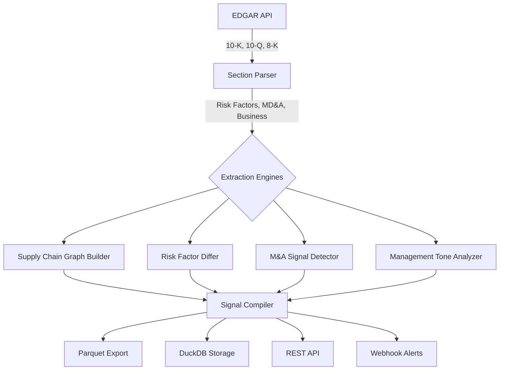

# alphasig

[](https://github.com/sushaan-k/alphasig/actions)
[](https://pypi.org/project/alphasig/)
[](https://pypi.org/project/alphasig/)
[](https://www.python.org/downloads/)
[](LICENSE)
[](https://github.com/astral-sh/ruff)

**Causal signal extraction from SEC filings using LLMs.**

`alphasig` turns filing text into structured, timestamped trading and monitoring signals. The focus is not generic sentiment, but directional changes in risk language, supplier exposure, M&A patterns, and topic-specific management tone.

---

## At a Glance

- Async EDGAR ingestion with filing parsing and section extraction
- LLM-assisted extraction engines for risk, supply chain, M&A, and tone
- Timestamped signal schema designed for storage and backtesting
- Supply-chain graph construction for second-order exposure analysis
- Parquet, DuckDB, API, and webhook outputs for downstream workflows

Every quant fund scrapes SEC filings, and sentiment scoring of 10-K/10-Q text is commoditized. **alphasig** does something different: it extracts *causal, structural relationships* buried in filings -- supply chain dependencies, risk factor escalations, M&A language patterns, and topic-level management tone shifts -- and compiles them into timestamped, backtestable signals.

## Why This Exists

The difference between "sentiment is positive" (useless) and "Company X just added 'supply chain concentration risk' to their 10-K for the first time, and their top supplier is Company Y which reports next week" (actionable).

Research shows ([Lazy Prices, Cohen et al. 2020](https://papers.ssrn.com/sol3/papers.cfm?abstract_id=1658471)) that changes in 10-K language are among the strongest predictors of future returns. alphasig operationalizes this insight.

## Showcase

The built-in supply-chain graph utilities render dependencies as a directed network where **nodes represent companies** and **edges represent disclosed supplier/customer relationships**. Each edge carries the relation, its context, the extraction confidence and -- only when the filing states one -- the concentration share (e.g. "customer accounted for 22% of net sales" -> `exposure=0.22`), which also sets the edge width in `graph.plot()`. This enables second-order risk propagation: when TSMC faces a disruption, identify the companies that depend on it directly or one hop removed.

## Architecture


```mermaid
graph TD
    A[EDGAR API] -->|10-K, 10-Q, 8-K| B[Section Parser]
    B -->|Risk Factors, MD&A, Business| C{Extraction Engines}
    C --> D[Supply Chain Graph Builder]
    C --> E[Risk Factor Differ]
    C --> F[M&A Signal Detector]
    C --> G[Management Tone Analyzer]
    D --> H[Signal Compiler]
    E --> H
    F --> H
    G --> H
    H --> I[Parquet Export]
    H --> J[DuckDB Storage]
    H --> K[REST API]
    H --> L[Webhook Alerts]
```

## Extraction Engines

| Engine | What It Does | Key Insight |
|---|---|---|
| **Supply Chain** | Extracts supplier/customer/partner relationships into a knowledge graph | When TSMC has a disruption, know exactly which companies are exposed |
| **Risk Differ** | Diffs Item 1A between consecutive filings; classifies NEW, REMOVED, ESCALATED, DE_ESCALATED | Legal language changes are the strongest predictive signals (Lazy Prices) |
| **M&A Detector** | Identifies strategic-alternatives language, advisor engagements, cash positioning shifts | Certain filing patterns strongly precede M&A announcements |
| **Tone Analyzer** | Tracks topic-specific management tone across filings on a 6-point scale | Not "positive/negative" but "confident → hedging" on specific topics |

## Signal Types

| Type | Example | Source |
|---|---|---|
| `supply_chain` | "AAPL depends_on TSM (advanced-node fabrication)" | Business, Risk Factors, MD&A |
| `risk_change` | "ESCALATED: Regulatory scrutiny in Item 1A" | Risk Factors vs. prior filing of the same form |
| `m_and_a` | "Strategic alternatives language in MD&A" | Every parsed section (whole document for 8-Ks) |
| `tone_shift` | "Management tone on margins shifted hedging → confident" | MD&A vs. prior filing of the same form |

Every signal is timestamped with the moment its filing became public (the
EDGAR acceptance time, in UTC), never the period end, so signals can be joined
to prices point-in-time without look-ahead bias.

## Quick Start

### Installation

```bash
pip install alphasig
```

### Basic Usage

```python
import asyncio
from alphasig import Pipeline

async def main():
    pipeline = Pipeline(
        user_agent="Your Name your@email.com",  # required by SEC EDGAR
    )

    signals = await pipeline.extract(
        tickers=["AAPL", "MSFT", "GOOGL"],
        filing_types=["10-K", "10-Q"],
        lookback_years=3,
        engines=["supply_chain", "risk_differ", "m_and_a", "tone"],
    )

    # Filter high-conviction bearish signals
    bearish = signals.by_direction("bearish").above_strength(0.7)
    for sig in bearish:
        print(f"[{sig.ticker}] {sig.context}")

    # Build supply chain graph (public counterparties are keyed by ticker)
    graph = signals.supply_chain_graph()
    exposure = graph.exposure("TSM")
    print(f"Companies exposed to TSMC: {exposure['direct_dependents']}")

    # Export for backtesting
    signals.to_parquet("signals.parquet")

asyncio.run(main())
```

The public API is designed around `Pipeline` and `SignalCollection`, so the same extraction run can feed notebooks, alerting, or backtests without an adapter layer.

For offline portfolio review, `rank_signals` converts any stored or exported
signals into a deterministic watchlist:

```python
from alphasig import SignalStore, rank_signals, summarize_sector_exposure

store = SignalStore("alphasig.duckdb")
signals = store.query(min_confidence=0.8, limit=100_000)
store.close()

report = rank_signals(signals, limit=20)
print(report.to_markdown())

sector_report = summarize_sector_exposure(signals, limit=5)
print(sector_report.to_json())
```

### CLI

```bash
export ANTHROPIC_API_KEY="sk-ant-..."
export ALPHASIG_USER_AGENT="Your Name your@email.com"

# Extract signals
alphasig extract --tickers AAPL MSFT --lookback 3 --output signals.parquet

# Query stored signals
alphasig query --ticker AAPL --type risk_change --min-strength 0.7

# Rank stored signals into a portfolio watchlist
alphasig rank --db alphasig.duckdb --min-confidence 0.8 --format markdown \
  --output reports/ranking.md

# Point-in-time ranking with a 90-day signal half-life
alphasig rank --as-of 2025-06-30T20:00:00Z --half-life 90

# Summarize directional exposure by sector
alphasig sectors --db alphasig.duckdb --exclude-unknown --format json \
  --output reports/sector_exposure.json

# Launch REST API
alphasig serve --port 8080
```

`rank` is fully offline: it reads the local DuckDB signal store, scores each
ticker by confidence-weighted directional strength, and can emit an
analyst-friendly table, JSON, or Markdown report. `--as-of` scores the store as
it stood at that time (later signals are excluded) and `--half-life` decays
each signal's strength exponentially with the given half-life in days.
Re-running `extract` over overlapping filings does not duplicate stored
signals.

`sectors` uses the same offline scoring model grouped through the built-in
sector map, making it useful for spotting concentrated bullish or bearish
portfolio exposure before a backtest or daily review.

### REST API

```bash
curl "http://localhost:8080/signals?ticker=AAPL&min_strength=0.7"
curl "http://localhost:8080/signals/summary"
curl "http://localhost:8080/signals/AAPL?signal_type=risk_change"
```

The server needs the `api` extra: `pip install "alphasig[api]"`.

### Webhooks

```python
from alphasig import SignalDirection
from alphasig.output.webhook import WebhookSender

sender = WebhookSender(
    "https://hooks.example.com/alphasig",
    min_strength=0.7,
    directions=[SignalDirection.BEARISH],
)
await sender.send_batch(signals)  # one POST with every qualifying signal
```

Network errors, 429s and 5xx responses are retried with backoff; 4xx
responses are not. Only the webhook host is logged, since webhook URLs often
embed a secret.

## Configuration

| Setting | Environment variable | Notes |
|---|---|---|
| Anthropic API key | `ANTHROPIC_API_KEY` | Or `Pipeline(api_key=...)` |
| EDGAR User-Agent | `ALPHASIG_USER_AGENT` | Required: `"Name email@domain"` per the SEC fair-access policy. Or `Pipeline(user_agent=...)` / `--user-agent` |
| Model | `ALPHASIG_MODEL` | Default `claude-sonnet-5`. Or `Pipeline(model=...)` / `--model` |

EDGAR requests share one connection pool and are spaced to stay under the
SEC's 10 requests/second limit, with backoff on 429/5xx that honours
`Retry-After`. Downloaded filings are cached in `./edgar_cache` (disable with
`cache_dir=None`). LLM calls reuse a cached system prompt per engine and are
retried by the Anthropic SDK on rate limits and overload.

## Signal Schema

Every signal follows a universal schema for backtesting compatibility:

```python
Signal(
    timestamp=datetime,          # When the filing became public (UTC)
    ticker="AAPL",               # Company ticker
    signal_type="risk_change",   # supply_chain | risk_change | m_and_a | tone_shift
    direction="bearish",         # bullish | bearish | neutral
    strength=0.85,               # 0.0 - 1.0
    confidence=0.92,             # 0.0 - 1.0
    context="ESCALATED: Supply chain concentration risk",
    source_filing="https://sec.gov/...",
    related_tickers=["TSMC"],
    metadata={...},              # Engine-specific details
)
```

## Project Structure

```
alphasig/
├── src/alphasig/
│   ├── __init__.py          # Public API
│   ├── edgar.py             # Async EDGAR client with rate limiting
│   ├── parser.py            # HTML filing section parser
│   ├── llm.py               # Anthropic LLM client wrapper
│   ├── pipeline.py          # Main orchestration
│   ├── signals.py           # SignalCollection with filtering/export
│   ├── graph.py             # Supply chain NetworkX graph
│   ├── storage.py           # DuckDB signal store
│   ├── reporting.py         # Offline ticker / sector ranking reports
│   ├── sectors.py           # Built-in sector map
│   ├── engines/
│   │   ├── supply_chain.py  # Supply chain extraction
│   │   ├── risk_differ.py   # Risk factor diffing
│   │   ├── m_and_a.py       # M&A signal detection
│   │   └── tone.py          # Management tone analysis
│   └── output/
│       ├── parquet.py       # Parquet/CSV export
│       ├── api.py           # FastAPI REST server
│       └── webhook.py       # Webhook notifications
├── tests/                   # pytest suite with mocked EDGAR/LLM
├── examples/
│   ├── demo.py              # Offline walkthrough (no API key needed)
│   ├── mag7_analysis.py     # Analyse Magnificent 7
│   ├── supply_chain_map.py  # Visualise supply chain graph
│   └── risk_monitor.py      # Monitor risk factor changes
└── docs/
    ├── engines.md           # Engine documentation
    ├── signal_schema.md     # Signal schema reference
    └── backtesting.md       # Backtesting integration guide
```

## Demo

Run the offline walkthrough with:

```bash
uv run python examples/demo.py
```

For EDGAR extraction and portfolio-scale signal analysis, see `examples/`.

## Development

```bash
git clone https://github.com/sushaan-k/alphasig.git
cd alphasig
uv sync --extra dev --extra api --extra viz   # or: pip install -e ".[dev,api,viz]"
uv run pytest
uv run ruff check src/ tests/
uv run ruff format --check src/ tests/
uv run mypy src/alphasig/
```

The test suite mocks EDGAR and the LLM and refuses real network access.

Upgrading from 0.1.x? The import package and CLI were renamed from `sigint`
to `alphasig` (the `sigint` command remains as an alias); see
[CHANGELOG.md](CHANGELOG.md).

## Research References

- "Lazy Prices" (Cohen, Malloy, Nguyen, 2020) -- 10-K language changes predict returns
- "FinToolBench: Benchmarking LLM Agents with Real-World Financial Tools" (arXiv:2603.08262, 2026)
- "From Deep Learning to LLMs: A Survey of AI in Quantitative Investment" (arXiv:2503.21422, 2026)
- SEC EDGAR Full-Text Search API documentation

## Contributing

1. Fork the repository
2. Create a feature branch (`git checkout -b feature/your-feature`)
3. Write tests for your changes
4. Ensure `pytest`, `ruff check`, and `mypy` pass
5. Submit a pull request

## License

MIT License. See [LICENSE](LICENSE) for details.
